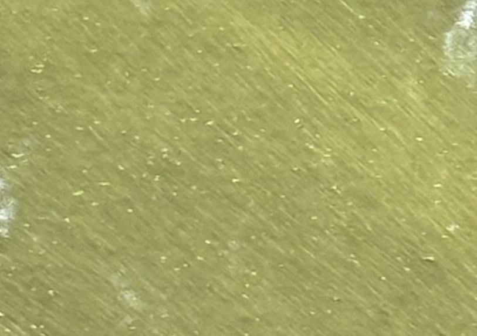

# algae-count


Quantitatively judge the amount of algal blooms in a given body of water.

## algae_index
Algae index is calculated by the following formula

```py
algae_index = green_channel - blue_channel - 30
```

We use the blue channel as reference for normal river colour, because sky reflections contribute a lot to the river's apparent colour in photographs

We expect the typical difference between green and blue RGB values to be ~30. Anomalies such as algae will cause the green channel to be significantly larger than the blue channel.

We only expect the green value to be up to 100 units larger than the blue value, so values are clipped.

This means that the `algae_index` is an *approximate* percentage for how much surface area is covered by algal bloom - although it may not be accurate. Regardless, relationships between `algae_index` and an actual percentage should be analogous, and investigating changes in `algae_index` will still yield some scientific benefit, even if it cannot be directly translated into a percentage.

---

## Example
`algal_index = 35.381048365457474`
